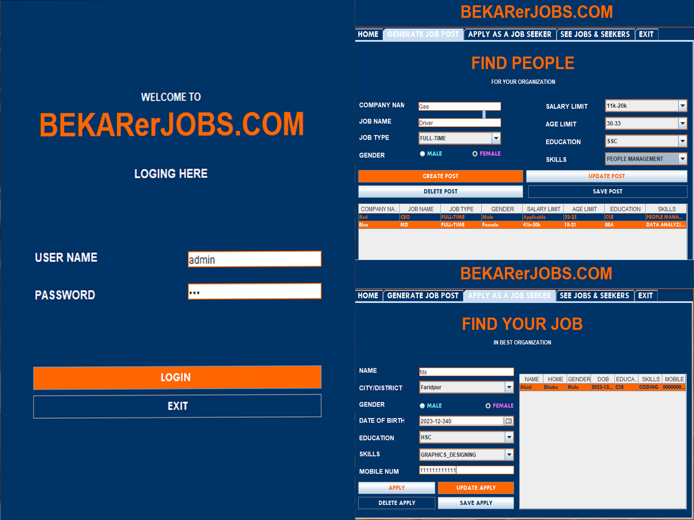

## **Introduction**
“BEKARerJOB” is a **Java-based Job Management System** with a graphical user interface built using **Java Swing**.  

This application allows you to:
- Manage job posts and job seekers’ profiles.  
- Add, update, and delete records easily.  
- Utilize file I/O for **data persistence**.  
- Work with **separate classes** for job posts and seekers to ensure modularity.  

Overall, the system serves as the basis for a **simple and easy-to-use job recruitment tool**.  

---

## Features
🔹 Job post management (Add / Update / Delete)  
🔹 Job seeker profile management (Add / Update / Delete)  
🔹 Data persistence through file I/O  
🔹 Modular design using separate classes  
🔹 Simple GUI for ease of use  

---

## Tech Stack
- **Programming Language**: Java  
- **GUI Framework**: Swing  
- **Data Handling**: File I/O  

---

## ScreenShot

- **FOR MORE IMAGE**: Open the .pdf file and read the report. I have provided detailed information about the project and pictures of each step.
